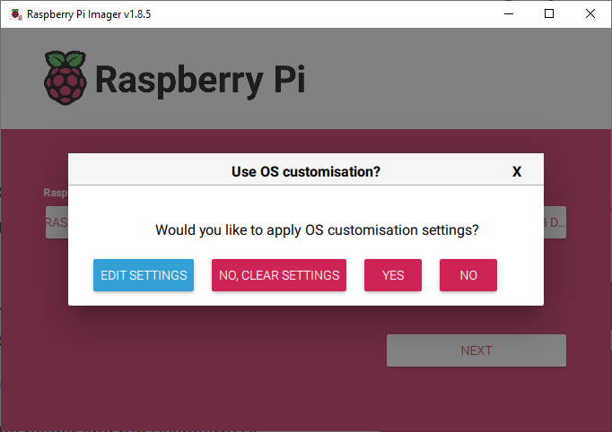

# Prepare the pi

## Requirements

- Raspbery Pi 3 or better
- 8 GB or bigger SD card
- Network cable
- Connection to a network that supports DHCP

1) Download, install and start the Raspberry Pi Imager

https://www.raspberrypi.com/software/

2) Flash the OS onto an SD card
- Select your PI
- Select the Operating System
  - Raspbery Pi OS (other)
  - Raspberry Pi OS Lite 64 Bit
- Select your storage  
- Select Next


3) Edit settings
- Click Edit Settings  
  
- Check mark "set username and password"  
- Enter a username and password

- Click Services
- Check Enable SSH

- Click Save
- Click Yes

- Confirm erasing mass storage device

3) Boot the raspberry pi with the newly formats SD card
4) Connect the raspberry pi to your network using the network cable
5) find the IP address of the pi
- If no other pi's exist on your network, usualy a ping to  `rasbperrypi.local` can confirm it responds
- You can check your DHCP logs to see what ip address it conncets to

6) Connect to the ssh of your pi

`ssh <username>@<ip address or hostname>`   
IE:  
`ssh pi@raspberrypi.local`  

## Configuring the pi to be a Q3 server

1) Install some basic dependencies

```
sudo bash
apt update
apt install -y zip nginx sudo curl screen dnsmasq git

mkdir /opt/q3
cd /opt/q3
```

2) Install Nodejs veersion 18

```
curl -sL https://deb.nodesource.com/setup_18.x | sudo -E bash -
apt-get install nodejs -y   
```


2) Install Quake compiled for a web client  
Source: https://github.com/inolen/quakejs.git

```
cd /opt/q3
wget https://github.com/inolen/quakejs/archive/refs/heads/master.zip
unzip master.zip
cd quakejs-master
npm install .

```

3) Configure local location of content and clear config

```
echo '{ "content": "10.0.0.1:9000" }' > bin/web.json
echo "{}" > bin/config.json
```

4) Create some scripts to loop services

```
cat <<"EOF"> qcon.sh
#!/bin/bash
cd /opt/q3/quakejs-master
while true
do
   node bin/content.js
   sleep 10
done
EOF

cat <<"EOF"> qs.sh
#!/bin/bash
cd /opt/q3/quakejs-master
while true
do
   node build/ioq3ded.js +set fs_game baseq3 +set dedicated 1 +exec server.cfg
   sleep 10
done
EOF

cat <<"EOF"> qc.sh
#!/bin/bash
cd /opt/q3/quakejs-master
while true
do
    #node build/ioq3ded.js +set fs_game baseq3 +set dedicated 2 +exec server.cfg  --config ./web.json
    node bin/web.js --config ./web.json
   sleep 10
done
EOF
chmod +x /opt/q3/quakejs-master/*.sh
```


5) Download assets

```
cd /opt/q3/quakejs-master
mkdir assets
cd assets
wget http://content.quakejs.com/assets/857908472-linuxq3ademo-1.11-6.x86.gz.sh -O linuxq3ademo-1.11-6.x86.gz.sh
wget http://content.quakejs.com/assets/296843703-linuxq3apoint-1.32b-3.x86.run -O linuxq3apoint-1.32b-3.x86.run
```

6) Configure game

```
cd /opt/q3/quakejs-master
mkdir  -p base/baseq3
cat <<"EOF"> base/baseq3/server.cfg
seta sv_hostname "10.0.0.1"
seta sv_maxclients 12
seta g_motd "Offline Quake"
seta g_quadfactor 3
seta g_gametype 2
seta timelimit 15
seta fraglimit 25
seta g_weaponrespawn 3
seta g_inactivity 1000
seta g_forcerespawn 0
seta rconpassword "password2000"
set d1 "map q3dm7 ; set nextmap vstr d2"
set d2 "map q3dm17 ; set nextmap vstr d3"
set d3 "map q3tourney2 ; set nextmap vstr d4"
set d4 "map q3dm1 ; set nextmap vstr d1"
vstr d1


seta bot_enable 1       // Allow bots on the server
seta bot_nochat 1       // Shut those fucking bots up
seta g_spskill 2        // Default skill of bots [1-5]
seta bot_minplayers 4   // This fills the server with bots to satisfy the minimum

EOF
```

7) Configure Wifi

Configure network insterface
```
cat <<"EOF">/etc/network/interfaces.d/wlan-ap
allow-hotplug wlan0
iface wlan0 inet static
    address 10.0.0.1
    netmask 255.255.255.0
    network 10.0.0.0
    broadcast 10.0.0.255
iface wlan0 inet6 static
    address fdfc::2
    netmask 64
EOF
```

Specify Country
```
raspi-config nonint do_wifi_country US
```
Configure wifi access point
```
sudo apt-get install hostapd iptables -y
cat <<"EOF"> /etc/hostapd/hostapd.conf
interface=wlan0
ssid=Quake_3_Arena
hw_mode=a
channel=36
country_code=CA
ieee80211n=1
ieee80211ac=1
wmm_enabled=1
EOF

sudo systemctl unmask hostapd
sudo systemctl enable hostapd
sudo systemctl start hostapd

```
Note: If your running an older pi without 5ghz ap update the following 2 lines in `/etc/hostapd/hostapd.conf`

```
hw_mode=g
channel=11
```


8) Configure captive portal and redirect

```
rm -rf  /etc/nginx/sites-enabled/default

cat <<"EOF">/etc/nginx/sites-enabled/all.conf
server {
  listen 80;
  listen [::]:80;
  location / {
  return 301 http://10.0.0.1:8080/?connect%2010.0.0.1:27960;
  }
  location /assets {
    proxy_pass         http://127.0.0.1:9000;
  }

}
server {
 listen 443;
 listen [::]:443;
 return 302 http://10.0.0.1;
 ssl_certificate /etc/ssl/certs/nginx-selfsigned.crt;
 ssl_certificate_key /etc/ssl/private/nginx-selfsigned.key;
 ssl_session_tickets off;
  ssl_protocols TLSv1.2 TLSv1.3;
  ssl_ciphers ECDHE-ECDSA-AES128-GCM-SHA256:ECDHE-RSA-AES128-GCM-SHA256:ECDHE-ECDSA-AES256-GCM-SHA384:ECDHE-RSA-AES256-GCM-SHA384:ECDHE-ECDSA-CHACHA20-POLY1305:ECDHE-RSA-CHACHA20-POLY1305:DHE-RSA-AES128-GCM-SHA256:DHE-RSA-AES256-GCM-SHA384;
  ssl_prefer_server_ciphers off;
 ssl_dhparam /etc/ssl/certs/dhparam.pem;
  resolver 1.1.1.1;
}
EOF
```

9) Make ssl cert to catch captive portal ssl

```
mkdir -p /etc/ssl/certs/
wget https://ssl-config.mozilla.org/ffdhe2048.txt -O "/etc/ssl/certs/dhparam.pem"

openssl req -x509 -nodes -days 365 -newkey rsa:2048 -keyout /etc/ssl/private/nginx-selfsigned.key -out /etc/ssl/certs/nginx-selfsigned.crt
```

10)  Accept ELUA  
Tip: press and hold enter untill you see Agree?

```
cd /opt/q3/quakejs-master
node build/ioq3ded.js +set fs_game baseq3 +set dedicated 1 +exec server.cfg
```
After accepting wait till server loads. You will se refrence to items and kills, Wxit using ctrl+c

11) configure DHCP and DNS

cat <<"EOF">/etc/dnsmasq.conf
dhcp-range=10.0.0.2,10.0.0.254,255.255.255.0,4h
bind-interfaces
address=/#/10.0.0.1
EOF

12) Configure everythign to start on boot
cat <<"EOF"> /etc/rc.local
#!/bin/bash
_IP=$(hostname -I) || true
if [ "$_IP" ]; then
  printf "My IP address is %s\n" "$_IP"
fi

# Start quake stuff
screen -dmS qserver /opt/q3/quakejs-master/qs.sh
screen -dmS qclient /opt/q3/quakejs-master/qc.sh
screen -dmS qcontent /opt/q3/quakejs-master/qcon.sh
iptables -t nat -A PREROUTING -i wlan-ap -p tcp -d 10.0.0.1 -j ACCEPT

# Enable captive portal like redicrect
iptables -t nat -A PREROUTING -i wlan-ap -p tcp -m tcp --dport 53 -j REDIRECT --to-port 53
iptables -t nat -A PREROUTING -i wlan-ap -p tcp -m tcp --dport 53 -j REDIRECT --to-port 53
iptables -t nat -A PREROUTING -i wlan-ap -p tcp -m tcp --dport 80 -j REDIRECT --to-port 80
iptables -t nat -A PREROUTING -i wlan-ap -p tcp -m tcp --dport 443 -j REDIRECT --to-port 443
EOF
chmod +x /etc/rc.local
```

13) Reboot
`reboot`

echo '{ "content": "content.quakejs.com" }' > bin/web.json
